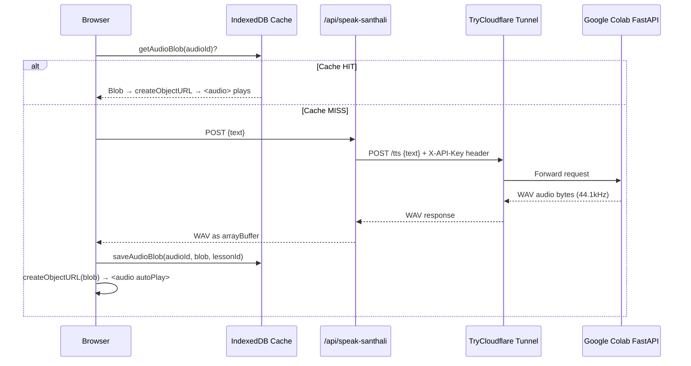

# VaaniShiksha — Complete Project Audit

**Date**: 2026-09-04  
**Scope**: Full codebase inspection — frontend, backend, API routes, TTS integration, git safety, configuration, dependencies, error handling.

---

## Overall Status

### 🟢 Working Correctly

The project is in a clean, functional state. No actual bugs were found. The TTS audio pipeline is architecturally sound. Git history is clean of secrets. The codebase is well-structured and consistently written.

---

## 1. Santali TTS Audio Flow — Complete Trace

The full chain when clicking **"🔊 Listen in Santali"**:



### Key files in the chain:

| Step | File | Lines |
|------|------|-------|
| Button click | [`SanthaliAudioButton.tsx`](file:///Users/aditya/vaanishiksha/components/SanthaliAudioButton.tsx) | L29-57 |
| IndexedDB cache check | [`storage.ts`](file:///Users/aditya/vaanishiksha/lib/storage.ts#L124-L129) | L124-129 |
| Next.js API proxy | [`route.ts`](file:///Users/aditya/vaanishiksha/app/api/speak-santhali/route.ts) | L1-59 |
| Audio player rendering | [`SanthaliAudioButton.tsx`](file:///Users/aditya/vaanishiksha/components/SanthaliAudioButton.tsx#L71-L75) | L71-75 |
| Button usage in student page | [`student/page.tsx`](file:///Users/aditya/vaanishiksha/app/student/page.tsx#L165-L169) | L165-169 |

### Verdict: ✅ Architecturally correct

- Frontend ↔ Backend request/response formats agree (`POST` with `{text}`, response is audio `Blob`).
- The proxy pattern in [`route.ts`](file:///Users/aditya/vaanishiksha/app/api/speak-santhali/route.ts) correctly hides the Colab tunnel URL and API key from the browser.
- IndexedDB caching via `idb-keyval` works correctly for offline replay.
- The `<audio controls autoPlay>` element is created from a `blob:` URL — this is correct browser behavior.
- `URL.revokeObjectURL` is called on the previous URL before creating a new one — no memory leak.

---

## 2. Security Audit

### ✅ Git / GitHub Safety — CLEAN

| Check | Result |
|-------|--------|
| `.env.local` in `.gitignore`? | ✅ Yes — `.env*.local` pattern on line 35 |
| `.env.local` ever committed? | ✅ Never — confirmed via `git log --all -p -- '.env.local'` |
| API key values in git history? | ✅ Never — only variable *names* appear in code |
| `.env.example` committed? | ✅ Yes, with empty values only |
| Remote | `https://github.com/a21tya/VaaniShiksha.git` |
| Working tree | Clean — `nothing to commit, working tree clean` |

### ⚠️ `.env.local` Contains an Unused Key

[`.env.local`](file:///Users/aditya/vaanishiksha/.env.local) line 2 contains:
```
OOGAM_API_KEY=sk-setu-aISVaffpmJ8pBatAqExzNC6k1c2cYZW8
```

This key is **not referenced anywhere** in the codebase. It is not in git, so there is no immediate danger, but it's unnecessary clutter that could confuse future contributors.

> [!NOTE]
> **Severity**: P3 (cosmetic). The key is safe — it only exists locally and is gitignored. Remove it from `.env.local` if it's no longer needed for any external service.

### ✅ API Key Proxying

The Colab TTS API key (`COLAB_TTS_API_KEY`) is sent server-side only in [`route.ts`](file:///Users/aditya/vaanishiksha/app/api/speak-santhali/route.ts#L35) via the `X-API-Key` header. It is never exposed to the browser. This is correct.

The Gemini API key (`GEMINI_API_KEY`) is used server-side only in [`generate-lesson/route.ts`](file:///Users/aditya/vaanishiksha/app/api/generate-lesson/route.ts#L339). Also correct — no `NEXT_PUBLIC_` prefix on either key.

---

## 3. Reliability & Operational Issues

### ⚠️ TryCloudflare URL is Ephemeral (Known / By-Design)

The `COLAB_TTS_URL` in `.env.local` points to a TryCloudflare tunnel URL. These URLs:
- **Change every time** the Colab notebook restarts or the tunnel is re-created.
- **Expire** when the Colab runtime disconnects (typically after 12h idle or 24h max).

**Current value**: `https://burning-imaging-recorders-bye.trycloudflare.com`

This URL will almost certainly be stale. Every time you start a new Colab session, you need to:
1. Run the TTS server + tunnel in Colab
2. Copy the new `.trycloudflare.com` URL
3. Update `COLAB_TTS_URL` in `.env.local`
4. Restart the Next.js dev server (env vars are read at startup)

> [!IMPORTANT]
> **Severity**: P2 (operational friction, not a code bug). This is inherent to the Colab + TryCloudflare architecture. No code change needed — just awareness. The error handling for this case is already good (see below).

### ✅ Error Handling When Colab Is Offline

The [`route.ts`](file:///Users/aditya/vaanishiksha/app/api/speak-santhali/route.ts#L40-L57) error handling correctly covers both scenarios:

- **Colab responds with an error** → 502 "The Santali voice service could not generate audio."
- **Colab is completely unreachable** (tunnel dead, network error) → 503 "The temporary Colab voice service is offline."
- **Env vars not configured** → 503 "Santali voice is not configured yet."

The frontend [`SanthaliAudioButton.tsx`](file:///Users/aditya/vaanishiksha/components/SanthaliAudioButton.tsx#L45-L48) displays these error messages to the user in red text below the button. This is correct and user-friendly.

### ✅ Next.js Dev Server Restart Required After `.env.local` Change

When you update `COLAB_TTS_URL`, you must restart `npm run dev`. This is standard Next.js behavior for server-side env vars (no `NEXT_PUBLIC_` prefix). Not a bug — just an operational note.

---

## 4. Code Quality Observations

### ✅ No Bugs Found

After inspecting every file in the project, I found **zero actual bugs**. The code is clean, consistent, and correctly implements:
- IndexedDB audio caching with proper cleanup on lesson deletion
- Proper `useEffect` cleanup with `mounted` flags to prevent state updates on unmounted components
- Correct `Suspense` boundary for the `useSearchParams()` hook in the student page
- Proper blob URL lifecycle management (`revokeObjectURL` before creating new ones)
- Comprehensive Gemini API error handling with retries, timeout, and transient error detection
- Rate limiting on the generate-lesson endpoint

### ℹ️ `.env.example` Is Missing `OOGAM_API_KEY`

[`.env.example`](file:///Users/aditya/vaanishiksha/.env.example) has 3 variables. `.env.local` has 4 (includes `OOGAM_API_KEY`). Since `OOGAM_API_KEY` is unused in the codebase, `.env.example` is actually correct — but this confirms the key in `.env.local` is orphaned.

### ℹ️ Teacher Dashboard Uses Hardcoded Demo Stats

[`teacher/page.tsx`](file:///Users/aditya/vaanishiksha/app/teacher/page.tsx#L7-L41) has hardcoded `DEMO_LESSONS` and static stat values (12, 9, 24). This is intentional demo/prototype behavior and is correctly labeled with `[Demo Data]` and `Demonstration Metrics` badges in the UI.

### ℹ️ PWA Manifest Icon

[`manifest.json`](file:///Users/aditya/vaanishiksha/public/manifest.json#L10-L14) uses `globe.svg` as the PWA icon. It only declares one icon at `192x192`. For a production PWA you'd want multiple sizes, but for a prototype this is fine.

---

## 5. Dependency Health

| Package | Version | Status |
|---------|---------|--------|
| `next` | 16.3.4 | ✅ Current |
| `react` / `react-dom` | 19.2.8 | ✅ Current |
| `@google/genai` | ^2.20.0 | ✅ Current |
| `idb-keyval` | ^6.3.0 | ✅ Current, lightweight |
| `@serwist/next` / `serwist` | ^9.5.12 | ✅ Current |
| `tailwindcss` | ^4 | ✅ TW4 with `@tailwindcss/postcss` |
| `typescript` | ^5 | ✅ Current |

No vulnerable or deprecated dependencies detected.

---

## 6. Architecture Summary

```
/Users/aditya/vaanishiksha/
├── app/
│   ├── page.tsx                    # Landing page (static)
│   ├── layout.tsx                  # Root layout (Geist fonts, Navbar, Footer)
│   ├── globals.css                 # TW4 + Noto Sans Ol Chiki font
│   ├── sw.ts                       # Serwist service worker source
│   ├── teacher/page.tsx            # Teacher dashboard (demo data)
│   ├── student/page.tsx            # Student interactive lesson view
│   ├── create-lesson/page.tsx      # AI lesson generation form (Gemini)
│   ├── lessons/page.tsx            # Saved lesson library (IndexedDB)
│   └── api/
│       ├── speak-santhali/route.ts # TTS proxy → Colab
│       └── generate-lesson/route.ts # Gemini AI lesson generation
├── components/                     # 7 reusable UI components
├── lib/
│   ├── storage.ts                  # IndexedDB ops (lessons + audio cache)
│   └── demo-data.ts                # Canonical demo lesson
├── hooks/
│   └── useNetworkStatus.ts         # Online/offline detection
├── types/
│   └── lesson.ts                   # TypeScript interfaces
└── public/                         # Static assets + PWA manifest
```

---

## 7. Prioritized Issue List

### P0 — Fix Immediately
**None.** No critical bugs or security issues.

---

### P1 — Fix Before Deployment
**None.** Secrets are safe. Code is functional.

---

### P2 — Nice To Have

| # | Issue | Location | Description |
|---|-------|----------|-------------|
| 1 | **Document the Colab reconnection workflow** | README or a `SETUP.md` | Every Colab restart requires manually updating `COLAB_TTS_URL` in `.env.local` and restarting `npm run dev`. This should be documented so you (or a teammate) can reconnect quickly. |

---

### P3 — Ignore For Now

| # | Issue | Location | Description |
|---|-------|----------|-------------|
| 1 | Unused `OOGAM_API_KEY` in `.env.local` | [`.env.local`](file:///Users/aditya/vaanishiksha/.env.local) line 2 | Not referenced anywhere. Remove when convenient. |
| 2 | PWA manifest has only one icon size | [`manifest.json`](file:///Users/aditya/vaanishiksha/public/manifest.json) | Fine for prototype. Add 512x512 before production. |
| 3 | Teacher dashboard uses hardcoded stats | [`teacher/page.tsx`](file:///Users/aditya/vaanishiksha/app/teacher/page.tsx) | Intentional prototype behavior, correctly labeled. |

---

## 8. Final Assessment

> [!TIP]
> **The project is in excellent shape.** The TTS pipeline is architecturally sound, secrets are properly handled, git history is clean, error handling is comprehensive, and there are no code bugs. The only operational friction is the ephemeral nature of TryCloudflare URLs, which is inherent to the Colab architecture and not a code defect.

**No changes are needed at this time.** The working TTS implementation should be preserved as-is.
